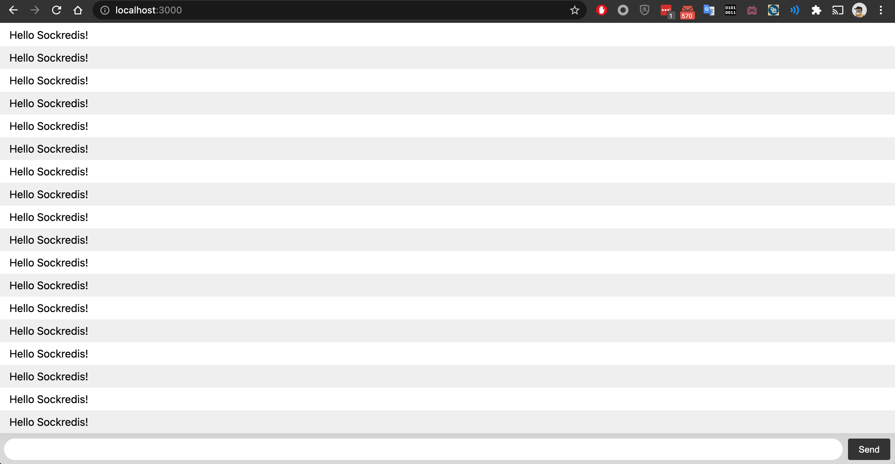
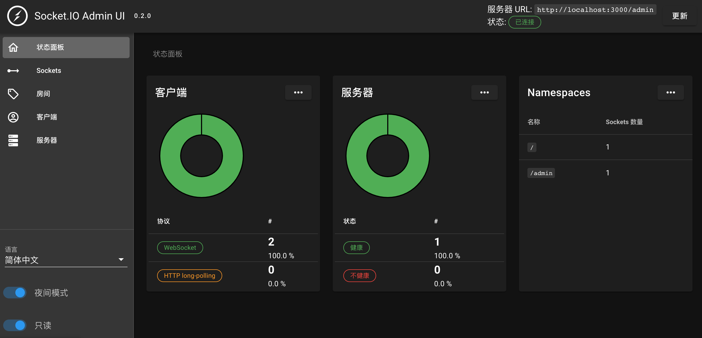

# SockRedis Broker

一个透明代理，能够将redis channel的消息通过socket.io 透明传输到网页。使用socket.io v4 和ioredis，使网页客户端可以使用sub命令订阅后端redis服务器上的消息通道。

## How to use

### 环境变量设置

``` sh
# 设置后端代理的redis服务器,默认为 127.0.0.1:6379
export REDISHOST=127.0.0.1
export REDISPORT=6379

# 设置sockredis服务器的监听端口,默认为 *3000
export LISTENPORT=3000

```

### 启动sockredis broker

```sh
npm install
. ./setenv.sh
npm .
```

### 通过docker-compose启动

```sh
docker-compose up -d
```

## 客户端示例

./example目录中是测试网页的实现，参照该例子，可以迅速接入客户端。

## 测试

1. 启动sockredis
2. 打开浏览器访问 `http://localhost:3000`打开测试页面，在页面底部输入框中输入订阅的通道“test”
3. 执行测试客户端,向test通道中发布消息”Hello Sockredis！“

    ```sh
     /pub2test.sh
    ```

4. 上部页面中开始以每秒4次的速度显示 “Hello Sockredis!"


5. 输入“none”命令，则停止接收所有消息。

## 监控

通过互联网，访问 `https://admin.socket.io`, 注册本地服务器 `https://localhost:3000/admin`, 将可以看到服务器状态和客户端连接情况。

